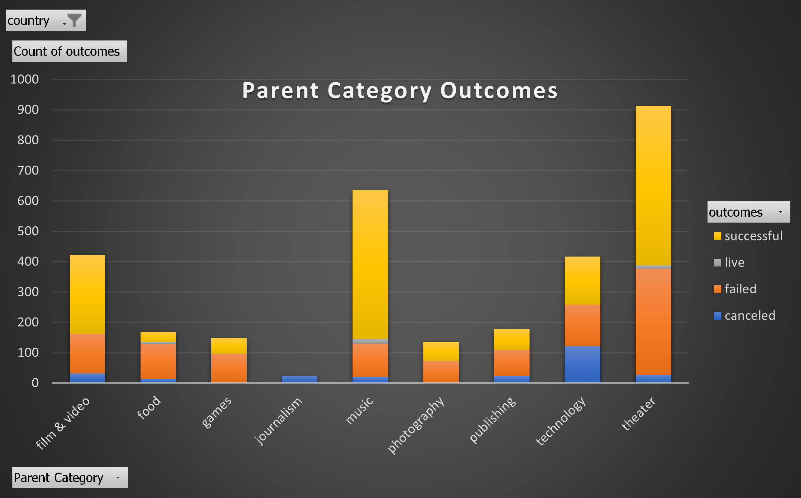
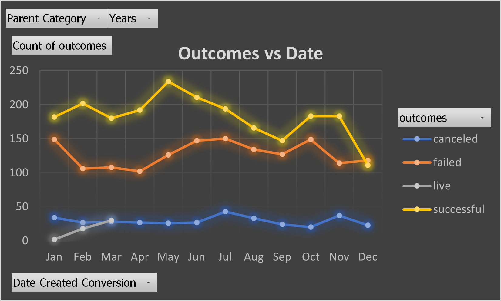
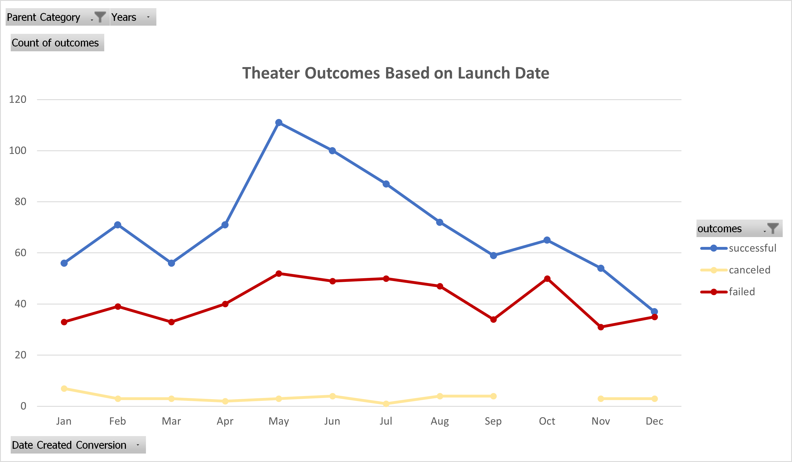
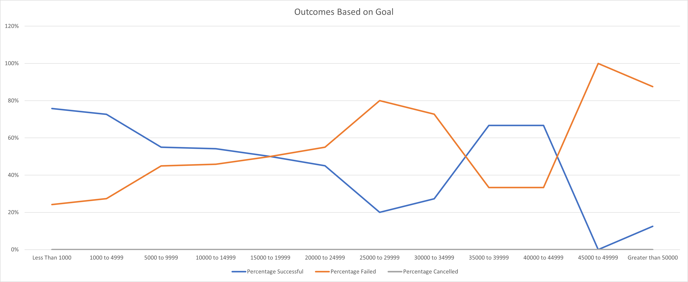

# An Analysis of Kickstarter Campaigns
&nbsp;&nbsp;&nbsp;&nbsp;&nbsp;&nbsp;The goal of this project is to perform analysis on Kickstarter data to uncover hidden trends that would help Louise maximize the probability of success of her new play, Fever.
By looking at multiple factors, we can apply statistical analysis to give Louise more insight on what areas to focus on, and how to improve her fundraising strategies. Looking at the data, the two most important variables to be considered are the timing of the fundraising launch date, and how high the fundraising goal is set.
---
## Analysis and Challenges
&nbsp;&nbsp;&nbsp;&nbsp;&nbsp;&nbsp;Once the data is fully imported into excel, the data first needs to be properly formatted (dates and monetary values in the proper formate, categories separated into subcategories, etc). One difficulty I ran into was splitting up on column that contained both categories and subcategories into two new columns. However with some quick googling, I was able to figure out that I needed to go to Data->Text to Columns. Once the raw data is formatted the way I like, the analysis can be done, most of which is done using pivot tables. It was slightly challenging figuring out which fields needed to be in which areas of the pivot table, but with a little bit of trial and error I got the data where it needed to go.

&nbsp;&nbsp;&nbsp;&nbsp;&nbsp;&nbsp;The first important variable we must consider is the timing of the launch date. This chart shows us the general success rate of fundraising campaigns of many different industries. Most importantly for Louise, the majority of theater fundraisers are successful. If we take this data, and plot it against the launch dates, we can maybe find a greater insight on how successful campaigns relate to the timing of the project.

  Looking at this chart, we can see that all successful kickstarter campaigns have a noticeable increased chance of success during the months of April to June. There could be many factors that go into this sharp bump (start of the summer, end of industry deadlines, etc).
---
## Results and Conclusion
&nbsp;&nbsp;&nbsp;&nbsp;&nbsp;&nbsp;If we further isolate just the theater fundraising campaigns, we can see that the new chart below has a very similar shape to the chart above.
  
  To maximize the success for Louise, she should: 1 - Launch her campaign in the months of April or May, and 2 - Avoid launching her campaign in the winter, especially in December.
---
&nbsp;&nbsp;&nbsp;&nbsp;&nbsp;&nbsp;The other important variable that needs to be considered is the monetary goal of the fundraiser.

&nbsp;&nbsp;&nbsp;&nbsp;&nbsp;&nbsp;Looking at the data, it should be obvious to see that the higher the goal of the campaign, the lower chance of success the fundraiser will have. Currently, Louise has a budget of a little over $10,000, which according to the data would give her a ~55% of success. Its not terrible but also not amazing. If Louise wishes to further increase her chance of success, she should try to lower her budget as much as possible. 
&nbsp;&nbsp;&nbsp;&nbsp;&nbsp;&nbsp;In conclusion, the monetary goal and launch date seem to be the most important variables to account for on paper. However there are important limitations of the data to consider: The data analyzed here is taken from only one source :kickstarter. To deepen our insight into the factors that affect successful fundraising, we should pull data from multiple different crowdsource companies. In the future, I recommend making a table and graph that compares how successful a campaign is to the full duration of the campaign. I suspect that campaigns that have the luxury of having a long drawn out run, would probably have a higher chance of reaching their monetary goals.

